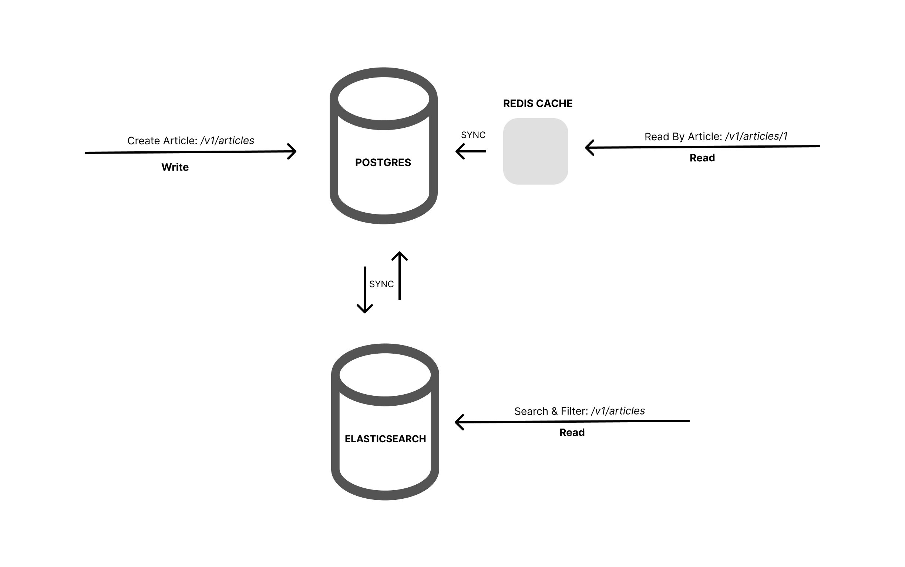

# Article WEB Service


## Table of Contents

- [Introduction](#introduction)
- [Features](#features)
- [Architecture Overview](#architecture-overview)
- [Getting Started](#getting-started)
- [Documentation API](#documentation-api)
- [Directory Structure](#directory-structure)

## Introduction

this project is a approach CQRS architecture and combine with DDD principles. built with golang and use Redis as cache and Elasticsearch for query data and PostgreSQL as database for write data and transaction. 
for http server we use HTTP web framework gin-gonic and for dependency injection we use wire. 

## Architecture Overview



## Features

- **Domain-Driven Design (DDD):** this project is designed with approach DDD perinciples, focusing on business concepts, leading to a more intuitive and maintainable codebase and a better understanding of the domain.

- **CQRS Architecture:** The Command Query Responsibility Segregation pattern separates read and write operations, improving performance, scalability, and flexibility.

- **Caching with Redis:** Redis is utilized as an in-memory cache to store frequently accessed data, reducing database load and improving response times.

- **Efficient Querying with Elasticsearch:** Elasticsearch empowers powerful search and querying capabilities, ensuring lightning-fast and accurate retrieval of information.

- **Write Operations with PostgreSQL:** PostgreSQL, a robust relational database, handles write operations with ACID compliance for data integrity and reliability.

## Getting Started

To start using this project, follow these steps:

- Clone the repository to your local machine.
- copy `.env.example` to `.env` and edit configre database and etc.
- Run the following command to build and run the project using docker-compose:
```
docker-compose up --build
```
wait for the project to be up and running and then navigate to `http://localhost:8080` in your browser to test the project is running.

## Documentation API
Documentation API please follow this link:
[https://documenter.getpostman.com/view/6069427/2s9Xy5LA6L](https://documenter.getpostman.com/view/6069427/2s9Xy5LA6L)

## Directory Structure

```
├── .env                        // .env for config environment
├── .env.example                // example env
├── Dockerfile
├── README.md
├── docker-compose.yml          // docker-compose file for deployment
├── go.mod
├── go.sum
├── cmd                         // command entry point
│   ├── cli                     // for command line entry point
│   ├── server                  // http server entry point
│       ├── main.go             // main entry point
│       └── runner              // wire injection and app initialization
├── internal                    // internal application
│   ├── caching                 // redis caching client
│   ├── elasticsearch           // elasticsearch client
│   ├── database                // postgres client and migration
│   └── app 
│       ├── article             // article domain  
│           └── article.go              // article domain, service, repository interfaces
│           ├── article_command.go      // article struct for command request
│           └── article_query.go        // article struct for query request
│           └── article_dto.go          // article struct for data transfer object
│           └── articleimpl             // article service, and repository implementation
│               └── article_command_repository.go // article repository implementation for command request
│               └── article_query_repository.go   // article repository implementation for query request
│               └── article_service.go            // article service implementation
│               └── article_caching_repository.go // article cache implementation
├── pkg                        // for package reuseable like, utils and etc.
```